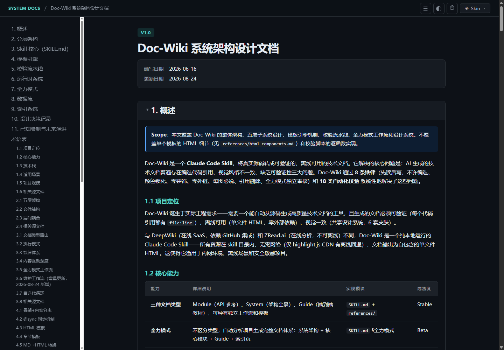
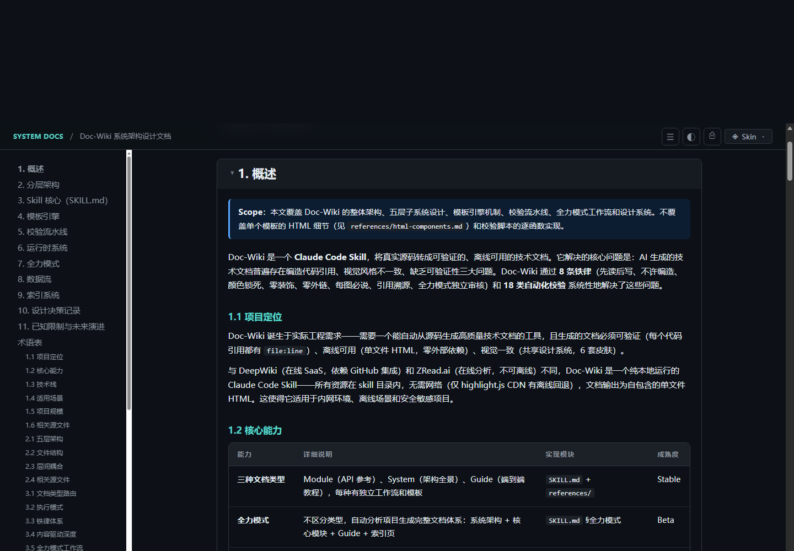
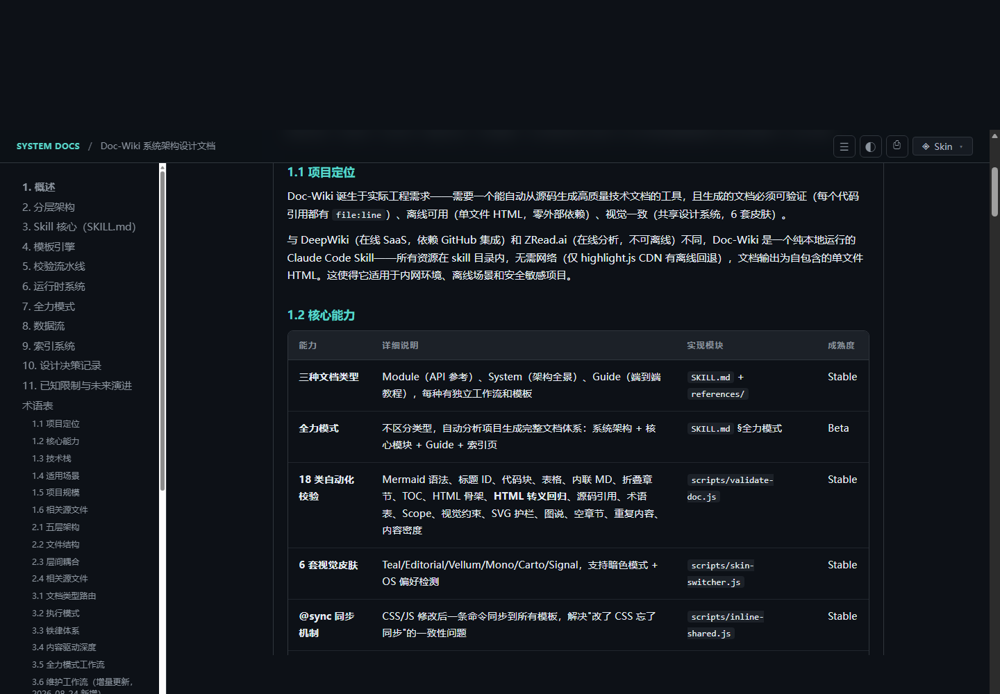

# Doc Writer 2.0

> Claude Code skill，从真实源码生成可验证的、离线可用的技术文档。

## 2.0 升级

2.0 保留现有文档类型和 HTML 工具链，新增语义保留、事实/推断/未知分级、项目术语映射及中英文语言 lint。主入口精简为路由与共享契约，详细工作流按需加载。严重事实错误不能由审核总分抵消，章节数与 token 消耗不作为质量门槛。

- [开发路线与验收计划](docs/plans/2.0-development-plan.md)
- [2.0 实际 skill 验收与复现步骤](docs/validation/2.0/README.md)
- [借鉴取舍与细节复查](docs/validation/2.0-refinement/README.md)
- [完整实际验收与修复记录](docs/validation/2.0-full/README.md)
- [当前工具链架构](doc/Quality_Tooling_System.html) · [上手教程](guide.html) · [模块索引](doc/tech-docs/index.html)
- [由 skill 实际生成的语言检查器模块文档](doc/tech-docs/Lint_Doc_Language_Design.md) · [HTML](doc/tech-docs/Lint_Doc_Language_Design.html)
- [写作质量规则](references/writing-quality.md)
- [检查工具、JSON 与基线迁移](references/quality-tooling.md)
- [全力模式](references/fullpower-workflow.md)

```bash
# Node.js 20+；不需要安装额外依赖
node scripts/lint-doc-language.js --mode explain doc/Design.md
node scripts/lint-doc-language.js --mode strict --terms doc/terms.json doc/API.md
node scripts/validate-doc.js --json doc/Design.html
node --test tests
```

语言检查独立于 HTML 校验；warning 默认不阻断，`--strict` 可将 warning 作为门禁。两工具都支持 JSON 与问题集合基线，不会用已修复的旧问题抵消新增问题。机械检查不能证明事实正确或改写语义等价。

已有 `doc/Doc_Wiki_System_Architecture.*` 和截图保留为 **1.x 历史快照**，其中源码行号、流程和工具清单不代表 2.0；当前说明以 SKILL.md 与 references 为准。升级不要求重刷全部存量文档。已移除生成后的静默 star 操作。

`技术文档` `设计文档` `架构` `guide` `deepwiki` `API文档` `模块文档` `系统设计` `HTML生成` `校验`

## About

把真实源码转成可验证的、离线可用的工程文档。不是营销页、不是 PPT——是"读完能上手干活"的技术文档。

支持三种文档类型：**module**（单模块 API 参考）、**system**（系统架构全景）、**guide**（端到端上手教程）。每种类型有独立的工作流、HTML 模板和校验规则，共享一套设计系统（6 套皮肤、暗色模式、响应式布局）。

核心原则：先读后写、不许编造、颜色锁死、零装饰、零外链、每图必说、引用溯源。

## Showcase — 实际效果

> Doc-Wiki 给自己生成的文档（[doc/Doc_Wiki_System_Architecture.md](doc/Doc_Wiki_System_Architecture.md)，
> 857 行 Markdown → 单文件 HTML，18 类校验全过）。**所有截图都是 skill 真实产出，不是设计稿。**

### 系统架构文档（system 类型）

[](doc/Doc_Wiki_System_Architecture.html)

*顶部：文档元信息（版本/日期/源码规模）、Scope 声明块、左侧自动生成 TOC（ScrollSpy 高亮）、
右侧正文渐进式披露结构。*

[](doc/Doc_Wiki_System_Architecture.html)

*中部：18 类校验流水线的代码块（语法高亮 + 复制按钮）与校验项表格。每个代码引用带 `file:line` 溯源。*

[](doc/Doc_Wiki_System_Architecture.html)

*维护工作流章节：增量更新的 M0-M4 阶段表、设计决策 callout（WHY 不是 WHAT）。*

### 三种文档类型的黄金样本

| 类型 | 内容样本（纯 HTML 片段，无骨架） | 说明 |
|------|-------------------------------|------|
| module | [examples/module-content-example.html](examples/module-content-example.html) | TaskScheduler API 参考：Scope + 源码引用 + SVG 图表 + Tabs |
| system | [examples/system-content-example.html](examples/system-content-example.html) | Layer Stack 组件 + Mermaid 架构图 + 五维模块表 |
| guide | [examples/guide-content-example.html](examples/guide-content-example.html) | Badge 标注 + 步骤指示器 + flow 组件 + FAQ |
| fullpower | [examples/fullpower-content-example.html](examples/fullpower-content-example.html) | 全力模式三层渐进式披露的深度内容 |

> 样本是"写对了长什么样"的黄金参考——只含填入 `{{SECTIONS}}` 的内容片段，骨架（CSS/JS/TOC/暗色模式）由模板提供。
> 完整效果请打开 [doc/Doc_Wiki_System_Architecture.html](doc/Doc_Wiki_System_Architecture.html)（连同本地 assets/vendor 交付后可离线打开，支持皮肤切换和暗色模式）。

## Guide — 上手指南

### 安装

```bash
# 复制到 Claude Code skills 目录
cp -r doc-wiki ~/.claude/skills/doc-writer
```

### 使用

在 Claude Code 中对任意项目说：

| 你说 | 生成什么 |
|------|---------|
| "给 TaskScheduler 写文档" | `doc/tech-docs/TaskScheduler_Design.md + .html` |
| "写系统设计文档" | `doc/<Name>_Design.md + .html` |
| "写项目指南 / guide" | `guide.html` |
| "分模块写文档" | 批量生成所有模块文档 + 索引页 |

不明确时会先问你选哪种类型。

### 三种文档类型

| 类型 | 定位 | 输出 | 适用场景 |
|------|------|------|---------|
| **module** | API 参考手册 | `.md` + `.html`，按需选章节 | 单个模块/类的详细设计 |
| **system** | 架构全景图 | `.md` + `.html`，Mermaid 架构图 | 整个系统的分层架构 |
| **guide** | 端到端教程 | 单文件 `.html`，沿数据流叙事 | 新人上手、排障 |

### 前置条件

- Node.js（运行校验和 MD→HTML 转换脚本）
- Claude Code（作为 skill 运行）

## System — 架构概览

```
doc-writer/
├── SKILL.md                      # Skill 主入口，路由 + 铁律 + 工作流
├── references/
│   ├── authoring-workflow.md     # 共享生成与审核流程
│   ├── writing-quality.md        # 语义保留、证据等级、术语规则
│   ├── quality-tooling.md        # JSON、基线与迁移说明
│   ├── fullpower-workflow.md     # 全力模式与独立审核
│   ├── guide-workflow.md         # Guide 类型详细流程
│   ├── system-workflow.md        # System 类型详细流程
│   ├── module-workflow.md        # Module 类型详细流程
│   ├── html-components.md        # 共享 HTML 组件规范 + 设计 Token
│   ├── maintenance-workflow.md    # 增量维护 M0-M4（drift 扫描/基线防回归）
│   └── tooling-notes.md           # 改 skill 脚本的实战坑（CRLF/pipefail/headless）
├── templates/
│   ├── guide.html                # Guide HTML 骨架
│   ├── system-design.html        # System HTML 骨架
│   ├── module-design.html        # Module HTML 骨架
│   ├── module-design.md          # Module MD 模板（中文）
│   ├── module-design.en.md       # Module MD 模板（英文）
│   ├── module-summary.md         # 模块摘要模板
│   ├── module-index.html         # 模块索引页模板
│   └── system-index.html         # 系统索引页模板
├── scripts/
│   ├── doc-shell.css             # 共享设计系统（~30KB）
│   ├── doc-shell.js              # 运行时功能（TOC/ScrollSpy/高亮/缩放）
│   ├── skin-switcher.js          # 6 套皮肤切换
│   ├── md-to-html.js             # MD → HTML 转换
│   ├── validate-doc.js           # HTML 校验与 JSON 基线
│   ├── lint-doc-language.js      # 中英文语言与术语检查
│   ├── lib/                     # 共用报告与正文扫描工具
│   └── inline-shared.js          # CSS/JS → 模板同步
└── examples/
    ├── guide-content-example.html
    ├── system-content-example.html
    └── module-content-example.html
```

### 工作流程

```
Phase 0: 分析源码（先读后写，记录 file:line）
    ↓
Phase 1: 结构设计（按类型选章节框架）
    ↓
Phase 2: 内容生成（MD + HTML 双格式 / 仅 HTML）
    ↓
Phase 2.5 / 2.6: 语义审核与聚焦修订
    ↓
Phase 3: HTML 校验 + 语言检查 + 必要视觉检查 + 基线防回归
```

### 共享运行时

三个文件被所有文档类型共享，通过 `@sync` 标记嵌入模板：

| 文件 | 职责 |
|------|------|
| `doc-shell.css` | 设计系统：字号梯度、间距规则、颜色变量、组件样式 |
| `doc-shell.js` | TOC 自动生成、ScrollSpy、代码高亮、图表缩放、Mermaid 暗色 |
| `skin-switcher.js` | Teal / Editorial / Vellum / Mono / Carto / Signal 6 套皮肤 |

修改后运行同步：

```bash
node scripts/inline-shared.js --sync
```

## Module — 核心模块

### md-to-html.js — 转换器

将 Markdown 文档转为带完整样式的单文件 HTML。

```bash
# 单文件转换
node scripts/md-to-html.js --type module doc/tech-docs/Task_Design.md
node scripts/md-to-html.js --type system doc/Architecture_Design.md
node scripts/md-to-html.js --type guide  doc/Guide.md

# 批量转换
node scripts/md-to-html.js --type module --all

# 生成索引页
node scripts/md-to-html.js --type module --index "ProjectName" "description"
```

### validate-doc.js — 校验器

18 类自动化检查（含 HTML 转义回归守卫），`--fix` 可自动修复部分问题：

```bash
node scripts/validate-doc.js --type module --new-doc doc/tech-docs/Task_Design.html
```

校验项：Mermaid 语法、章节 ID 唯一性、代码块标签、表格结构、TOC 完整性、HTML 转义回归（结构性标签被转义成文本）、源码引用格式、术语表、Scope 声明、视觉约束（无渐变/大阴影/外链图片/硬编码色）、SVG 护栏、图说完整性、空章节、重复内容、内容密度。

### SKILL.md — 路由与规则

Skill 主入口，包含：

- **文档类型路由**：分发到 guide / system / module / batch / maintain
- **共享契约**：先读后写、证据分级、语义保留、术语一致、引用溯源、内容驱动深度、视觉与离线、审核门禁
- **内容驱动深度**：章节取舍判据是源码复杂度，不是模板框架
- **澄清边界**：先查证源码；仅关键缺口或范围歧义需要询问

### templates/ — HTML 骨架

每个模板提供完整的 HTML 骨架（CSS/JS 已内嵌），内容填入 `{{SECTIONS}}` 占位符：

- **guide.html** — 侧边栏 TOC、badge 标注、步骤指示器、暗色模式
- **system-design.html** — Mermaid 渲染、模块折叠面板、交互式图表缩放
- **module-design.html** — Tabs API 展示、SVG 图表、可折叠章节

### html-components.md — 设计规范

共享的 HTML 组件规范和设计 Token 硬约束：

- 字号梯度（H1 32px → H2 22px → H3 17px → body 15px）
- 间距规则（4px 步进）
- 圆角上限 8px（药丸 badge 除外）
- 颜色全部来自 CSS 变量，禁止硬编码 hex

### inline-shared.js — 模板同步

CSS/JS 修改后，将变更同步到所有 HTML 模板的 `@sync` 标记区域：

```bash
node scripts/inline-shared.js --sync
```

## 铁律

1. **不读源码不动手** — 没读过的函数/类/模块 = 不存在
2. **不许编造** — 宁可 `<!-- TODO -->` 也不造假
3. **颜色锁死** — 只用 CSS 变量，禁止 inline `color: #hex`
4. **零装饰** — 无渐变、大阴影、blur、浮起动画
5. **零外链** — 图表用 SVG/CSS/Mermaid 内联
6. **每图必说** — 所有图表必须有 `<figcaption>`
7. **引用溯源** — 代码引用必须带 `file:line`
