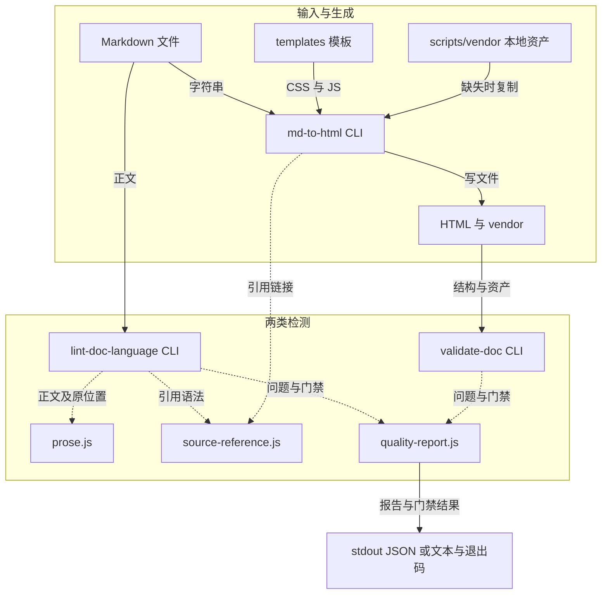

# JavaScript 文档转换与质量工具链架构

## 文档信息

| 项目 | 内容 |
|---|---|
| 文档版本 | 1.0 |
| 编写日期 | 2026-10-05 |
| 目标读者 | 调用 CLI、接入检查和维护工具链的开发者 |
| 文档类型 | system |
| 源码位置 | scripts/md-to-html.js、scripts/lint-doc-language.js、scripts/validate-doc.js、scripts/lib |
| 关联产物 | [教程](../guide.html)、[模块索引](tech-docs/index.html) |

## 1. 定位、范围与运行环境

> **Scope**：覆盖当前 JavaScript Markdown 转换、语言检查和 HTML 质量工具链，包括三个 CLI、三个共享库、本地模板/vendor 与相关测试。其他辅助脚本仅列边界；不承诺全库所有 API。

工具链将可维护 Markdown 转成带导航和本地资产的 HTML，并提供两个独立质量报告。语言 lint 检查正文启发式和显式术语；HTML validator 检查产物结构、资源及交互接线。事实、引用含义与改写语义仍由人工审核。

技术栈是 Node.js CommonJS、同步 fs/path/crypto 和浏览器端 JavaScript/CSS。质量 CLI 推荐 Node.js 20+，本轮使用 v20.20.2 和 Windows PowerShell。无需安装第三方 Node 包；HTML 运行依赖本地 highlight 与 Mermaid vendor，不是零依赖网页。

本轮快照为仓库 eae95fe 加当前转换器工作树修复，精确文件散列见 docs/validation/full-generation/source-snapshot.json。历史自文档保留其 1.x 快照，不能用来推断当前行为。

Sources：{{../scripts/md-to-html.js:21-58}}、{{../scripts/lint-doc-language.js:4-7}}、{{../scripts/validate-doc.js:20-22}}、{{../references/quality-tooling.md:1-3}}。

## 2. 架构与依赖方向

图示区分内容流和共享调用。

> 图 2.1 — 实线标注输入/产物，虚线标注共享调用。节点为实际模块或本地资产。来源三个 CLI 的 require、buildHtml 与 validateFile。

转换与检测没有自动串联入口：调用者安排 lint、转换、validator 的顺序。转换成功不能替代质量检查；validator 不重跑语言 lint。浏览器交互 JS 来自模板，Node CLI 不启动浏览器。

Sources：{{../scripts/md-to-html.js:269-280}}、{{../scripts/md-to-html.js:655-792}}、{{../scripts/lint-doc-language.js:48-84}}、{{../scripts/validate-doc.js:1069-1124}}。

## 3. 核心模块职责与故障路径

### Markdown 转换器

路径 scripts/md-to-html.js；公开操作是 CLI，没有 module.exports。参数选类型与模板，parseMarkdownSections 提取标题/元信息/章节，mdBodyToHtml 转正文，buildHtml 组装页面并写同名 HTML。依赖 fs、path、source-reference、模板和 vendor；上游是文档作者，下游是 validator 与浏览器。

显式类型 module/system/guide 优先；否则按文件路径猜类型。批量转换按类型 scanDir 与 filePattern 过滤。生成器并非完整 CommonMark 解析器：表格按竖线拆列，行内 raw HTML 不等于受支持正文语法。源码简写生成实际 source-ref 链接；语法合法不证明文件存在。

缺失文件、非 Markdown 文件、空匹配集合、未知选项或缺少选项值返回失败。已有 HTML 且未 force 是合法 skip。显式 .MD 输入大小写均支持，输出扩展名为 .html，不修改 Markdown；--all 的模式过滤仍使用源码配置，不能据此推断会发现所有大写文件。

Sources：{{../scripts/md-to-html.js:25-58}}、{{../scripts/md-to-html.js:282-296}}、{{../scripts/md-to-html.js:342-441}}、{{../scripts/md-to-html.js:869-929}}。

### 语言检查器与正文扫描

路径 scripts/lint-doc-language.js、scripts/lib/prose.js、scripts/lib/punctuation.js。lint/validateTerms/parseArgs/main 是语言模块的全部导出；正文模块导出 proseSegments/location/decodeEntities。CLI 读目标并根据后缀选 HTML 或 Markdown，提取片段，执行七条规则并构造问题。

语言模块依赖三个库，prose 本身无外部模块依赖。目标读取/扫描异常转 input/read；配置错误转 fatal。合法源码引用中的路径被排除所有语言规则，附近正文保留位置。段落误掩码、跨行句子和异常嵌套仍需要人工复核。

Sources：{{../scripts/lint-doc-language.js:48-84}}、{{../scripts/lint-doc-language.js:106-140}}、{{../scripts/lib/prose.js:75-101}}。完整接口见 [语言模块](tech-docs/Lint_Doc_Language_Design.html)、[正文模块](tech-docs/Prose_Design.html)。

### HTML 校验器

路径 scripts/validate-doc.js；公开操作是 CLI，没有 module.exports。validateFile 执行 Mermaid、标题 ID、代码语言、表格、TOC、骨架、转义、无 CDN、本地资产、引用、术语表、Scope、视觉/图表及内容结构检查。--test-interactive 增加静态交互接线和渐进披露检查，不会操作浏览器。

它依赖 fs、path 和 quality-report；下游是 CLI 门禁。--new-doc 将缺失来源/术语/Scope 等适用项作为新文档门禁。--fix 只针对实现支持的格式修复并写回 HTML，不自动修正事实。读取目标失败记 input/read，未知配置或无扫描目标失败。

Sources：{{../scripts/validate-doc.js:24-78}}、{{../scripts/validate-doc.js:1069-1124}}、{{../scripts/validate-doc.js:1154-1190}}。

### 质量报告与源码引用

quality-report.js 导出 digest、relativeFile、issue、makeReport、compareBaseline、gate、readJson。两检测器调用它生成 schemaVersion=1 报告、相对路径、身份和基线门禁。依赖内建 fs/path/crypto；失败包含读取/JSON/基线 schema 或配置不一致。

source-reference.js 只导出 parseSourceReference，返回 file/start/end/label/href 或 null，被 lint 与转换器共用。不读源文件，不验证引用含义。范围倒序或行号零无效；单行/正序范围合法。源码路径应按最终 HTML 目录计算。

Sources：{{../scripts/lib/quality-report.js:8-86}}、{{../scripts/lib/source-reference.js:5-15}}。完整报告契约见 [报告模块](tech-docs/Quality_Report_Design.html)。

### 保真度与链接检查

check-doc-fidelity.js 把 .md 与同名 .html 往返比对，报告丢失或被改写的代码、标题、表格，并识别围栏不配对（`fence-unbalanced`）和“关闭行带信息串”造成的疑似吞章（`fence-suspect`），以及停在“## 目录”段里、会随生成侧栏一并丢失的内容（`toc-swallowed`）。check-doc-links.js 检查生成后 HTML 的相对链接、锚点和源码引用行号；在 git 仓库里加 `--require-tracked`，还报“目标在本机存在、git 却不跟踪”的链接（`untracked-target`，含路径大小写与 git 不一致），这类链接在作者机器上永远不报错，别人克隆下来才是死链。两者只读不改，补上 validate-doc.js 看不到的内容丢失与死链。

退出码均为 0 通过、1 有问题、2 用法错误。外部地址和根相对路径无法静态判定，links 不检查。

Sources：{{../scripts/check-doc-fidelity.js:3-16}}、{{../scripts/check-doc-links.js:3-26}}。用法与问题类型见 [quality-tooling.md](../references/quality-tooling.md)。

## 4. 输入、配置与输出数据

| 配置 | 当前行为与不当值后果 |
|---|---|
| 转换 --type | module/system/guide；显式类型优先；无效类型失败 |
| 转换 --root | 批量扫描与索引输出根，默认 CWD；显式文件仍按 CWD 解析 |
| 转换 --force / --dry-run | 重建已有 HTML / 预览不写；默认已有 HTML skip |
| 转换 --lang | HTML lang，默认 zh-CN；不翻译内容 |
| 语言 --mode | explain 默认，strict 添加模糊/多动作提示并收紧句长 |
| 两检测器 --strict | warning 阻断；与语言 mode 独立 |
| 语言 --terms | version=1 与 terms 数组；名称/合法别名/禁用词冲突失败 |
| 检测 --root | 相对报告根；HTML --all 同时按该根扫描 |
| 检测 --baseline | 同工具、targets、profile；不一致 fatal/1 |
| HTML --new-doc / --test-interactive | 新文档结构要求 / 静态交互检查；均进入 profile |

转换器 module 默认扫描 doc/tech-docs 中 `_Design.md`，后缀忽略大小写；system 扫描 doc 根所有 Markdown，排除 Guide.md 后缀；guide 的 --all 扫 doc 与项目根中 Guide.md 后缀，忽略大小写。根 guide.md 本轮另用显式文件与 --type guide 转换。索引只收集当前已存在的匹配 HTML，guide 没有索引。

doc-meta.json 是可选索引品牌/分组配置，不是检查器术语配置。module 使用 modules/groups/groupOrder；system 使用 categories。非法 JSON 回退默认分类，不证明配置合法。索引不生成缺失文档。

语言报告 profile engine=4；HTML profile engine=2。JSON 的 tool、targets、profile、issues、summary 不是 HTML 页面结构。fatal 只有 schemaVersion/tool/fatal，调用者不能假定每次输出都有 summary。

Sources：{{../scripts/md-to-html.js:60-265}}、{{../scripts/md-to-html.js:798-826}}、{{../scripts/lint-doc-language.js:85-140}}、{{../scripts/validate-doc.js:24-62}}、{{../scripts/validate-doc.js:1181-1188}}。

## 5. 端到端数据与报告门禁

Markdown 的代码围栏和引用标签经过转换生成代码块和 anchor；模板 CSS/JS 及本地 vendor 使 HTML 支持导航与图表。语言扫描使用原输入字符串及实体映射，生成含 line/column/context 的 issue。HTML 检查把分类的 fail/warn 转 issue，另保留 files[].checks。

quality-report 构造排序后的 targets、稳定 profile、全部当前 summary。基线用问题身份多重集合计算 added/resolved/unchanged。默认只阻断新增 error，strict 也阻断新增 warning；当前 input/ 问题总阻断。保留旧问题时退出 0 不代表全部问题消失。

退出码 0 表示机械门禁通过，1 表示阻断 error 或输入/配置错误，2 表示 strict warning 阻断。转换器不使用这个质量报告协议：它输出转换计数或错误文本；不能把转换 stdout 当报告 JSON。

Sources：{{../scripts/lib/prose.js:75-100}}、{{../scripts/lib/quality-report.js:22-83}}、{{../scripts/validate-doc.js:1154-1188}}、{{../scripts/md-to-html.js:920-929}}。

## 6. 执行模型与资源落位

所读三个 CLI 使用同步文件 I/O，按目标循环处理；没有 worker_threads、后台任务或服务监听入口。浏览器模板代码只在打开 HTML 后运行。本文不据此承诺跨进程并发写同一产物安全；未测竞态、延迟或吞吐量。

stageVendorAssets 从 scripts/vendor 复制缺失文件，已存在文件不覆盖，复制错误被忽略。输出位于 module 的 ../assets/vendor 或 system/guide 的 assets/vendor。缺失或过期资产应以实际存在性与浏览器运行核对；复制“尽力而为”不是离线保证。HTML 校验只检查本地引用的存在性，不验证功能正确。

Sources：{{../scripts/md-to-html.js:269-280}}、{{../scripts/md-to-html.js:892-929}}、{{../scripts/validate-doc.js:1032-1048}}。

## 7. 术语表、辅助边界与验证

| 术语 | 定义 |
|---|---|
| Markdown 维护来源 | 作者编辑的文档输入 |
| HTML 产物 | 转换器生成的可阅读页面 |
| 正文片段 | 排除语法/代码后的物理行单元格 |
| 问题 issue | 带身份与严重度的检测结果 |
| 基线 baseline | 同配置下的旧问题多重集合 |
| vendor | 随 scripts 分发并复制到产物目录的本地 JS/CSS |

inline-shared、skin-switcher、html-to-md 等辅助脚本不在本次 API 文档范围；本文只说明本次不调用它们。没有编造部署服务、数据库或消息队列。模板内部全部交互 API 未逐项文档化，浏览器验证另由主 agent 完成。

已运行教程端到端 CLI、两个模块 API 示例、module --all 批量转换、module/system 索引及新文档 HTML/语言门禁。实际结果和未通过项以 docs/validation/full-generation 中记录为准，不用历史报告背书。独立审核由另一 agent 提供，本生成阶段不宣称全力验收已全部完成。

Sources：{{../scripts/md-to-html.js:798-929}}、{{../tests/conversion.test.js:10-41}}、{{../tests/skill-e2e.test.js:21-70}}。教程见 [完整示例](../guide.html)。
