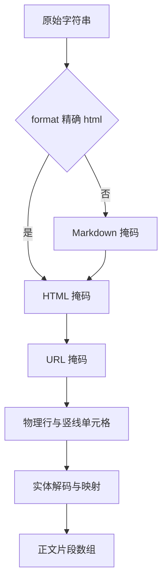

# prose 正文扫描模块设计

## 文档信息

| 项目 | 内容 |
|---|---|
| 文档版本 | 1.0 |
| 编写日期 | 2026-10-05 |
| 目标读者 | 扩展语言检查与原始文件定位的开发者 |
| 实现文件 | scripts/lib/prose.js |
| 测试文件 | tests/language.test.js |
| 关联文档 | [系统架构](../Quality_Tooling_System.html)、[语言模块](Lint_Doc_Language_Design.html)、[上手教程](../../guide.html) |

## 1. 概述与边界

> **Scope**：覆盖 prose.js 全部三个导出和内部掩码流程；不承诺完整 Markdown/HTML 解析或浏览器可见性判断。

语言 lint 需要正文和原文件位置。prose 把代码、运行时文本和语法替换成等长空格，而不是删除；换行保留。它返回正文片段及 UTF-16 偏移映射，lint 用映射报告原文件行列。模块不读文件，不输出日志，也不改变传入字符串。

`proseSegments` 被 lint 调用，`decodeEntities` 用于片段实体解码，`location` 将原文件偏移转为位置。没有外部模块依赖。算法以正则和物理行处理，未建立 Markdown AST 或 HTML DOM。

Sources：{{../../scripts/lib/prose.js:3-7}}、{{../../scripts/lint-doc-language.js:7}}、{{../../scripts/lint-doc-language.js:48-56}}。

## 3. 数据流与实现

图示说明转换顺序。

> 图 3.1 — 实线是数据转换；实体映射用于回到原文件。来源 prose.js:75-100。



Markdown 排除从首行开始的 frontmatter、围栏、行内反引号代码、4 空格或 tab 缩进代码、链接定义和图片。围栏可带列表或引用前缀，结束标记必须同字符、长度不小于起始标记且没有其他尾随内容。frontmatter 首行 trim 后为三个短横线，结束行是三个短横线或三个点。

链接目标与 Markdown 分隔符被掩去，链接标签保留。HTML 掩码在两种格式下均执行：先去注释，再排除 pre、code、script、style、svg、textarea 整块。class 含 mermaid 的 div/pre 按同标签嵌套深度寻找结束位置；最后掩去其余标签。

URL 匹配 http、https 和 www 前缀。剩余内容按 CRLF/LF 分行，再按每个竖线分格；空白或仅有冒号/短横线的格不产生片段。格内 trim 后才解码，offset 指向其首个非空白位置。

这种近似扫描的边界必须保留：正文中的竖线也被拆格；CSS 隐藏文字仍可能扫描；跨行长句不会被组装。未闭合 frontmatter、围栏或排除块可能隐藏后续正文。不能将“未发现问题”解释为正文完整覆盖。

Sources：{{../../scripts/lib/prose.js:26-45}}、{{../../scripts/lib/prose.js:46-74}}、{{../../scripts/lib/prose.js:75-94}}。

## 4. 术语表与片段契约

| 术语/字段 | 类型 | 定义 |
|---|---|---|
| 正文片段 segment | object | 一个非空的物理行单元格 |
| text | string | 掩码与 trim 后的实体解码文字 |
| offset | number | 片段起点相对原文件的 UTF-16 单元偏移 |
| offsets | number[] | 解码后每个 UTF-16 单元相对未解码片段的位置 |
| 行号 line | number | 从 1 开始，以换行字符计数 |
| 列号 column | number | 从 1 开始，以 UTF-16 代码单元计数 |

例如 `a&#108;b` 解码为 `alb`，映射为 `[0,1,7]`。实体生成的各代码单元都指向实体开始位置；补充平面字符有两个 UTF-16 单元，两项指向同一实体。非实体文本逐单元一一映射。

支持实体名 amp、lt、gt、quot、apos、nbsp，忽略大小写；数字支持十进制和 x 开头十六进制。数字大于 0 且不超过 0x10ffff 才转换；其他保留原 token。未列出的命名实体不解码。代码点范围判断不另排除代理区。

Sources：{{../../scripts/lib/prose.js:7-25}}、{{../../scripts/lib/prose.js:85-100}}。

## 8. 完整公开 API

| 签名 | 输入、默认与返回 | 失败/副作用 |
|---|---|---|
| proseSegments(source, format) | source 字符串；format 精确 html 走 HTML，其余走 Markdown；返回片段数组 | 无文件 I/O；未校验输入类型，错误类型可抛运行时异常 |
| decodeEntities(text) | text 字符串；返回 text 和 offsets 对象 | 不检查文件；没有配置参数 |
| location(source, offset) | source 字符串，原文件零起始 UTF-16 偏移；返回 line、column | offset 不做范围/整数校验，调用者应传有效偏移 |

内部 blank、mask、maskMarkdown、maskHtml 不导出。location 的列数为 offset 减前一个换行索引；文件开头没有换行时前一索引为 -1，因此第一个单元列为 1。

lint 使用 `segment.offset + segment.offsets[index]` 定位；缺少映射项时退回 index。format 不是按内容猜测，CLI 按扩展名选择后显式传入。

Sources：{{../../scripts/lib/prose.js:96-101}}、{{../../scripts/lint-doc-language.js:53-56}}、{{../../scripts/lint-doc-language.js:120}}。

## 9. 已运行示例与调用约束

在项目根运行下面的断言。样例使用 CRLF 和实体来验证原位置，不要求浏览器或安装包。

```javascript
// ========== 位置信息示例 ==========
const assert = require('node:assert/strict');
const { decodeEntities, location, proseSegments } = require('./scripts/lib/prose');
assert.deepEqual(decodeEntities('a&#108;b'), {text:'alb', offsets:[0,1,7]});
assert.deepEqual(location('一\r\n二', 3), {line:2, column:1});
const parts = proseSegments('<p>a&#108;b</p>', 'html');
assert.equal(parts[0].text, 'alb');
assert.equal(parts[0].offset, 3);
assert.equal(parts[0].offset + parts[0].offsets[1], 4);
```

此代码已由 examples/full-validation/module-api.js 实际执行。没有跨线程压力测试或性能测量；同步、无文件 I/O 的实现不等于已证明线程安全。扩展掩码时应核对字符串长度、CRLF、实体长度变化及附近文字定位。

Sources：{{../../scripts/lib/prose.js:5-25}}、{{../../scripts/lib/prose.js:75-100}}。

## 11. 测试与限制

tests/language.test.js 通过 lint 间接测试正文占位符、表格、围栏、frontmatter、链接标签、HTML 实体和代码/runtime/SVG/Mermaid 排除。CRLF 与实体位置有断言。本文 API 例子另直接运行三个导出，不把它说成生产测试文件。

未确认完整解析语法覆盖、所有非法嵌套和 Unicode 边界；当前没有独立 prose.test.js。浏览器渲染及语义独立复审由其他 agent 执行，本生成记录不能代替它们。

Sources：{{../../tests/language.test.js:52-110}}。完整执行输出在 docs/validation/full-generation；每次命令的返回码另存 commands.json。
