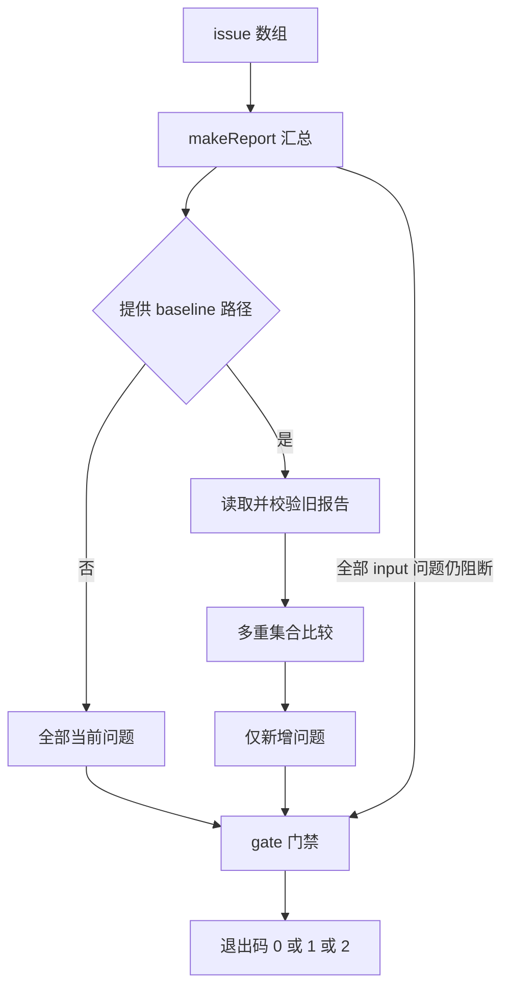

# quality-report 质量报告模块设计

## 文档信息

| 项目 | 内容 |
|---|---|
| 文档版本 | 1.0 |
| 编写日期 | 2026-10-05 |
| 目标读者 | 集成报告与基线门禁的开发者 |
| 实现文件 | scripts/lib/quality-report.js |
| 测试文件 | tests/quality-report.test.js、tests/cli.test.js |
| 关联文档 | [系统架构](../Quality_Tooling_System.html)、[上手教程](../../guide.html)、[语言模块](Lint_Doc_Language_Design.html) |

## 1. 概述

> **Scope**：覆盖 quality-report.js 的全部七个导出、报告结构、身份与基线门禁；不覆盖每条 HTML 或语言检测算法。

语言 lint 和 HTML validator 共享本模块。检查器提供问题，本模块负责稳定散列、相对路径、汇总、基线比较和退出码。它不会决定文本事实正确性，也不会把 warning 自动改成错误问题。strict 改变的是门禁。

digest 使用内建 crypto；相对路径使用 path；readJson 与基线读取使用 fs 同步 I/O。compareBaseline 和 issue 不读文件。gate 有可见副作用：传基线路径时把比较结果附到传入 report.baseline。

Sources：{{../../scripts/lib/quality-report.js:3-6}}、{{../../scripts/lib/quality-report.js:78-86}}、{{../../scripts/lint-doc-language.js:6}}、{{../../scripts/validate-doc.js:22}}。

## 3. 报告处理流程

图示显示可选基线与门禁。

> 图 3.1 — 先判断 input 问题和 error，再判断 strict warning。来源 quality-report.js:55-83。



stable 递归排序对象键而保留数组顺序；digest 对稳定 JSON 做 SHA-256。问题身份包含 file、rule、severity 与 key，不包含 line/column。key 优先显式值，其次 context，最后 message。问题内容改变可能变成新身份，移动行不变。

基线比较用身份计数。增加一个同身份副本仍进入 added；删除进入 resolved；unchanged 是当前问题中被旧数量抵消的数量。修掉旧错误不能抵消另一个新错误。

Sources：{{../../scripts/lib/quality-report.js:8-28}}、{{../../scripts/lib/quality-report.js:55-77}}。

## 4. 术语表与数据契约

| 术语 | 定义 |
|---|---|
| issue，问题 | 一项检测结果，含规则、严重度、身份与消息 |
| report，报告 | 某组 targets、profile 下当前全部问题和汇总 |
| baseline，基线 | 同工具、同目标集合、同 profile 的先前 JSON 报告 |
| added / resolved | 当前新增 / 旧报告中已消失的问题数组 |
| unchanged | 仍存在的匹配副本数量 |

| 字段 | 类型与含义 |
|---|---|
| schemaVersion | 数字 1 |
| tool | 字符串；CLI 分别 doc-language、doc-html |
| targets | 去重排序后的文件路径字符串数组 |
| profile | 递归键排序的检查配置对象 |
| issues | 问题数组；顺序由调用者提供 |
| summary | files 为去重目标数，errors/warnings 为全部当前计数 |
| baseline | gate 读取基线后附加的 added、resolved、unchanged |

issue 必需输出 id、file、rule、severity、message；line、column、context 仅在参数不是 undefined 时附加。id 是 64 个小写十六进制字符。key 是身份输入，不输出为字段。

验证基线时检查 schemaVersion、tool、targets、profile 存在及 issues 数组。每项问题要求合法 id、file 属于 targets、字符串 rule/message 与 error/warning 严重度。不会重新计算 id；不校验 summary、位置或 profile 内部业务字段。基线 schema 通过不证明来源真实。

Sources：{{../../scripts/lib/quality-report.js:22-54}}。

## 8. 全部公开 API

| 签名 | 参数与结果 | 失败/副作用 |
|---|---|---|
| digest(value) | 可 JSON 序列化值 → 散列字符串 | 循环对象等可失败；对象键稳定、数组顺序保留 |
| relativeFile(file, root) | 文件路径与根路径 → 使用 / 的相对路径 | file 先绝对化；不验证存在或限定根下，可含 ../ |
| issue(fields) | 问题字段 → issue 对象 | 无参数 schema 校验；line 等可选 |
| makeReport(tool, targets, profile, issues, extra={}) | → 普通报告 | 无业务校验；extra 最后展开可覆盖已生成字段 |
| compareBaseline(current, previous) | 两报告 → added、resolved、unchanged | 无 I/O，不修改两报告；结构或配置不一致抛 Error |
| gate(report, options={}) | baseline 路径、strict 默认 false → 0/1/2 | 有基线时读取文件并改变 report；读取/比较错误抛出 |
| readJson(file) | 文件路径 → JSON 值 | 同步 UTF-8 读取并去掉开头一个 BOM；文件/JSON 错误抛出 |

stable、validateReport 和 SCHEMA_VERSION 不导出。直接调用 makeReport 不校验未知 severity，summary 只统计精确 error/warning；集成代码必须保持正确契约。

compareBaseline 比较 tool、targets 和 profile 的 digest。makeReport 已排序 targets，但手工构造未排序 targets 可能被拒绝。术语数组换序也可能改变配置散列。CLI 的 --root 变更可能改变 file 和 targets，不能随意切换报告根。

Sources：{{../../scripts/lib/quality-report.js:15-42}}、{{../../scripts/lib/quality-report.js:55-86}}。

## 9. 已运行 API 示例

下面把历史占位符错误保留为基线，再增加一个副本。基线比较不执行检测，必须由调用者先生成当前报告。

```javascript
// ========== 多重集合比较 ==========
const assert = require('node:assert/strict');
const {issue, makeReport, compareBaseline, gate} = require('./scripts/lib/quality-report');
const old = issue({file:'a.md',rule:'placeholder',severity:'error',message:'未替换',context:'sample',line:1});
const moved = issue({file:'a.md',rule:'placeholder',severity:'error',message:'未替换',context:'sample',line:20});
assert.equal(old.id, moved.id);
const report = items => makeReport('example',['a.md'],{engine:1},items);
const delta = compareBaseline(report([moved, moved]), report([old]));
assert.equal(delta.added.length, 1);
assert.equal(delta.unchanged, 1);
assert.equal(gate(report([old])), 1);
const warning = issue({file:'a.md',rule:'review',severity:'warning',message:'复查'});
assert.equal(gate(report([warning])), 0);
assert.equal(gate(report([warning]), {strict:true}), 2);
```

代码已由 examples/full-validation/module-api.js 实际运行。profile 中 engine=1 是此独立 example 的配置值，不是生产 CLI 的当前引擎。生产语言引擎为 3，HTML 引擎为 2。

Sources：{{../../scripts/lib/quality-report.js:55-83}}、{{../../scripts/lint-doc-language.js:123-124}}、{{../../scripts/validate-doc.js:1181-1186}}。

## 10. 门禁与排障

无基线时 gate 使用全部 issues；有基线时使用 added。任何当前 rule 以 input/ 开头都返回 1；新增 error 返回 1；strict 且有新增 warning 返回 2；其他返回 0。summary 始终显示全部当前问题，0 不意味着历史问题清零。

配置不一致时比较抛 Error，CLI 转 fatal JSON 并退出 1。若移动行导致新增，检查 context/key 是否也改动；若新增重复未阻断，检查你是否错误地对 issues 去重。HTML 检查身份部分还含结构证据，变化不必对应单一 DOM 缺陷。

这些排障是实现推导，不是历史事故记录。并发文件写入、跨线程保障和性能尚未测量；读取基线是同步读取某一时刻文件，不提供事务或锁。

Sources：{{../../scripts/lib/quality-report.js:78-83}}、{{../../scripts/validate-doc.js:1051-1067}}。

## 11. 当前测试与验证边界

quality-report.test.js 有四个顶层 test：路径和移动行身份、替换新问题、重复副本/删除、配置与非法 schema。CLI 测试另验证 JSON BOM、输入失败、warning 基线和配置变化；模块示例直接验证非基线 strict 退出码。

完整命令和输出存于 docs/validation/full-generation。未测代码覆盖率、所有 JSON 非法值、并发竞争或极端大报告。本生成阶段未运行浏览器；独立审核由其他 agent 提供，机械通过不能替代审核。

Sources：{{../../tests/quality-report.test.js:9-39}}、{{../../tests/cli.test.js:25-61}}、{{../../tests/cli.test.js:106-133}}。
