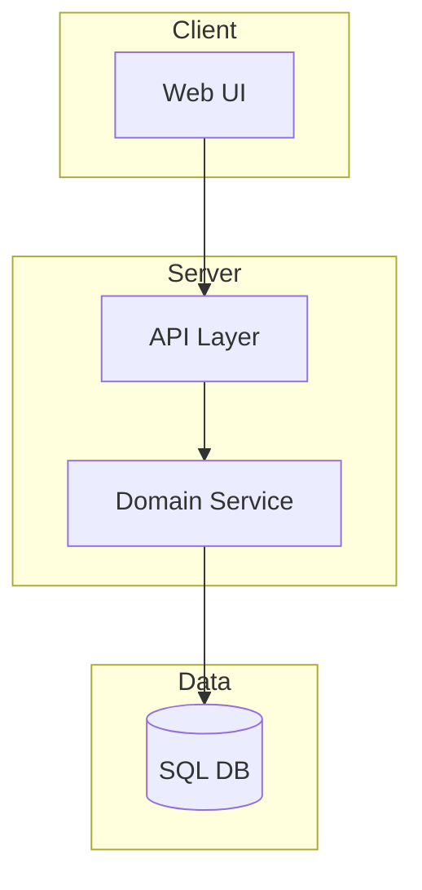

# 系统架构文档工作流程

Phase 0（仓库扫描）已在 SKILL.md 中完成。本文件从 Phase 1 开始。

## 输出

```
doc/<Name>_Design.md         ← 系统架构文档 (Markdown)
doc/<Name>_Design.html       ← 系统架构文档 (HTML, Mermaid + 代码高亮)
doc/index.html               ← 索引导航页
```

## 与模块文档的区别

| 特性 | system | module |
|------|--------|--------|
| 输出级别 | 系统级架构 | 模块级设计 |
| 输出位置 | `doc/` | `doc/tech-docs/` |
| 内容范围 | 多组件协作、数据流、线程模型 | 单模块 API、实现细节 |
| 图表 | Mermaid 架构图 | ASCII/SVG 类图、状态图 |

## Phase 0 扩展：代码分析输出结构

> 以下是 SKILL.md Phase 0 共同要求的扩展。**先完成共同要求（禁止不读代码就生成、记录源码位置、提取术语），再执行本节。**

仓库扫描时，按以下结构组织分析结果：

```json
{
  "project": "项目名",
  "purpose": "一句话描述",
  "stack": ["语言", "框架", "运行时"],
  "entry_points": ["main.cpp", "index.ts"],
  "modules": [
    {
      "name": "模块名",
      "paths": ["src/module/"],
      "responsibility": "职责描述",
      "depends_on": ["依赖模块"],
      "used_by": ["被谁使用"]
    }
  ],
  "data_flow": ["A → B → C"],
  "risks": ["耦合点", "缺失测试"],
  "unknowns": ["不确定的部分"]
}
```

分析规则：
- 不复述文件内容，只提炼结构和作用
- 优先关注：入口文件、路由定义、服务注册、ORM schema、配置文件、消息/事件定义
- 仓库较大时，先给 80/20 高价值视图，再列建议深挖区域
- **不得臆造未在仓库中出现的服务、模块或依赖**

## Phase 1: 结构设计

系统文档按**分层架构**组织：

| 章节 | 必须 | 说明 |
|------|------|------|
| 1. 概述 | Y | 项目目标、核心业务域 |
| 2. 技术栈 | Y | 语言、框架、运行时、构建工具 |
| 3. 分层架构 | Y | Mermaid 架构图 + 层级说明 |
| 4. 核心模块职责 | Y | 每模块摘要（使用模块摘要模板） |
| 5. 数据流 | Y | 数据从输入到输出的路径 |
| 6. 线程模型 | 如适用 | 线程/进程/协程关系 |
| 7. 配置系统 | 如适用 | 配置文件结构、参数说明 |
| 8. 部署 | 可选 | 部署方式、环境配置 |
| 9. 已知限制 | 可选 | 技术债务、已知缺陷、架构约束、未来演进方向 |

### 每章深度标准（Deep Enough Checklist）

| 章 | 最低包含 | 浅 (不合格) | 深 (合格) |
|----|---------|------------|----------|
| 1. 概述 | Scope + 项目定位(≥2段) + 核心价值点(列表) + 技术约束 | "本项目是一个调度框架" | 解决什么问题 + 为什么用这种架构 + 核心价值3-5点 + 技术约束(语言/平台/性能目标) |
| 3. 架构图 | Mermaid 图(≥8节点) + 每个 subgraph 解释 + 箭头含义 + figcaption | 一张图 + "系统架构如图所示" | 图 + 每层/每个 subgraph 的段落解释 + 数据流方向标注 + 关键路径标识 |
| 4. 模块职责 | **每个核心模块**的五维度摘要 + 至少 1 处代码引用 | 每模块一句话 | 每模块：职责段落 + 路径 + 核心API(≥3个) + 依赖关系 + 被依赖关系 + 故障模式 + 源码引用 |
| 5. 数据流 | 端到端数据路径 + 每阶段的数据格式/类型 + 关键转换点 | "数据从 A 流向 B" | A(类型) → B(通过什么方法) → C(转换为什么) + 每阶段具体数据结构 |
| 6. 线程模型 | 线程/锁/原子量的完整映射 + 竞态风险点 | "使用了多线程" | 每个线程的职责 + 共享数据的保护方式 + 性能关键路径的锁策略 |
| 7. 配置系统 | 配置层级 + 每个参数的含义/类型/默认值/取值影响 | 贴一段 JSON 无解释 | JSON 示例 + 逐字段解释 + 不当值的后果 + 调参建议 |

### 分层分类体系

分析仓库时，将模块归入以下层级：

- **Interface Layer** — UI、CLI、API 入口
- **Application Layer** — 业务编排、用例
- **Domain Layer** — 核心业务逻辑、领域模型
- **Data Layer** — 持久化、数据库、文件 I/O
- **Infra Layer** — 日志、配置、工具类
- **Cross-cutting** — 安全、监控、错误处理
- **Tests** — 测试代码
- **Build / Tooling** — 构建脚本、CI/CD

## Phase 2: 内容生成

### Mermaid 架构图规则

默认使用 `flowchart TD`：



Mermaid 规则：
- 节点命名用"模块名 + 角色"，如 `API Gateway`、`Auth Service`
- 单图节点数 **8-18 个**，超过则拆分子图
- 用 `subgraph` 表达层级边界
- 箭头方向体现主调用链或数据流方向
- 不要编造不存在的数据库、中间件或微服务
- 先输出一句 20 字以内的图说明，再输出 Mermaid 代码块
- 如有不确定边，图后列出 `Assumptions`

### 模块摘要

使用 `templates/module-summary.md` 模板为每个核心模块生成摘要：

```markdown
# {module_name}

## Responsibility
{一句话职责}

## Paths
- {文件路径}

## Public API
- `{symbol}`: {用途}

## Dependencies
- {依赖模块}

## Failure Modes
- {可能的故障}
```

写作规则：
- 先写"它做什么"，再写"它依赖什么"，最后写"容易出什么问题"
- 避免摘抄源码注释，改写为工程语言
- 只保留高价值函数、类、接口和配置键
- 若模块高度耦合，明确指出耦合对象

### HTML 生成

使用 `templates/system-design.html` 作为骨架。

HTML 特性：
- **Mermaid 图表**：客户端渲染（mermaid.js CDN），支持深色/浅色主题
- **代码高亮**：highlight.js
- **模块折叠面板**：H3 级模块详情自动折叠
- **Mermaid 交互式放大**：点击全屏、滚轮缩放（20%-500%）、拖拽平移

## MD 转 HTML

```bash
node "$SKILL_ROOT/scripts/md-to-html.js" --type system doc/<Name>_Design.md
node "$SKILL_ROOT/scripts/md-to-html.js" --type system --all
node "$SKILL_ROOT/scripts/md-to-html.js" --type system --index "项目名" "描述"
```

## Good vs Bad 对照

**Mermaid 架构图：**

```
✅ GOOD — 节点命名清晰，8-18 个节点，subgraph 表达层级

flowchart TD
  subgraph Interface
    CLI[CLI 控制台]
    API[REST API]
  end
  subgraph Domain
    RM[RecipeManager]
    TS[TaskScheduler]
  end
  CLI --> RM --> TS

❌ BAD — 节点太多无法阅读 / 命名用 A、B、C / 没有 subgraph 分层

flowchart TD
  A --> B --> C --> D --> E --> F --> G --> H
  A --> C
  B --> D
  E --> G
```

**模块职责摘要：**

```html
<!-- ✅ GOOD — 五维度完整：路径、API、依赖、被依赖、故障模式 -->
<h3>TaskScheduler</h3>
<p><strong>职责：</strong>基于优先级的任务调度，支持依赖关系和取消传播。</p>
<table>
  <tr><td>路径</td><td><code>src/scheduler/</code></td></tr>
  <tr><td>核心 API</td><td><code>schedule()</code>, <code>cancel()</code></td></tr>
  <tr><td>依赖</td><td>ThreadPool, PriorityQueue</td></tr>
  <tr><td>被依赖</td><td>SequenceEngine</td></tr>
  <tr><td>故障模式</td><td>队列满 → 拒绝新任务并返回 QueueFullError</td></tr>
</table>

<!-- ❌ BAD — 只写一句话，没有 API、依赖和故障信息 -->
<h3>TaskScheduler</h3>
<p>负责任务调度。</p>
```

**跨模块约束：**

```html
<!-- ✅ GOOD — 指出具体的架构约束和违规后果 -->
<div class="callout warning">
  <strong>注意</strong>
  RecipeManager 和 TaskScheduler 之间不存在直接依赖。SequenceEngine 负责桥接。
  如果发现二者直接交互的代码，属于架构违规。
</div>

<!-- ❌ BAD — 泛泛而谈 -->
<div class="callout warning">
  <strong>注意</strong>
  模块之间要保持低耦合。
</div>
```

## Operating Model

- 输入优先使用 repo map、符号表、README、配置文件、入口文件
- 所有回答引用文件路径、符号名、函数名
- 证据不足时明确写出"不确定"和缺失上下文
- **不得臆造未在仓库中出现的服务、模块或依赖**
